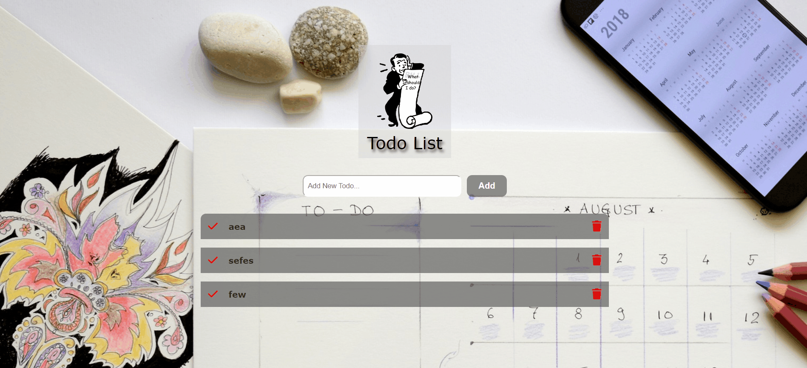

 

## 👷🏻‍♀️👋🏻 Hi there, I'm Halil

 🐱‍🏍 I'm Automotive Engineer but I find myself in software. 
 
🎆 Exploring routes to new visions and be a part of the new visions. 
 
 🧐 A new age enthusiast. 
 
☕ Coffee is how I keep up with code

#### 📬 Connect with me:

 
 
 

<h2 align="center">🚀Technical Skills</h2>

      

 

 

 

 

 
<!--
 
-->
<h2 align="center">My Projects</h2>

###

| Project Demo                                                                                                    | Libraries and Technologies I use | Project Preview          |
| :-------------------------------------------------------------------------------------------------------------- | -------------------------------- | ------------------------ |
| [Vanilla JS Todo App](https://haliltuzcu.github.io/to-do/) <h3>[Repo](https://haliltuzcu.github.io/to-do/)</h3> | Vanilla JS, PureCSS              |  |
| [Boostrap web page](https://haliltuzcu.github.io/bootstrap/) <h3>[Repo](https://haliltuzcu.github.io/bootstrap/)</h3> | Boostrap              |  |
| [Vanilla JS weather_app](https://haliltuzcu.github.io/weather_app/) <h3>[Repo](https://haliltuzcu.github.io/weather_app/)</h3> | weather_app              |  |

 

<h2 align="center">💡Most Used Language</h2>

 
    
  

